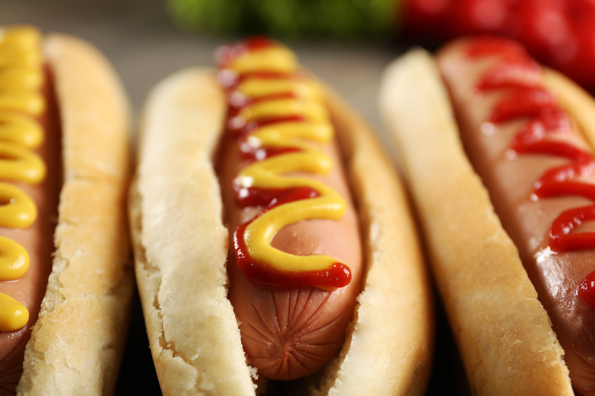

# hotdogify

## Press to Hotdog!

This is a Chromium extension that adds a button that, when pressed, will replace all images on the active tab with randomized pictures of hot dogs.

###### NOTE: If the button doesn't work, try closing and reopening the menu for the button, and/or refreshing the page.

### Installation Video

